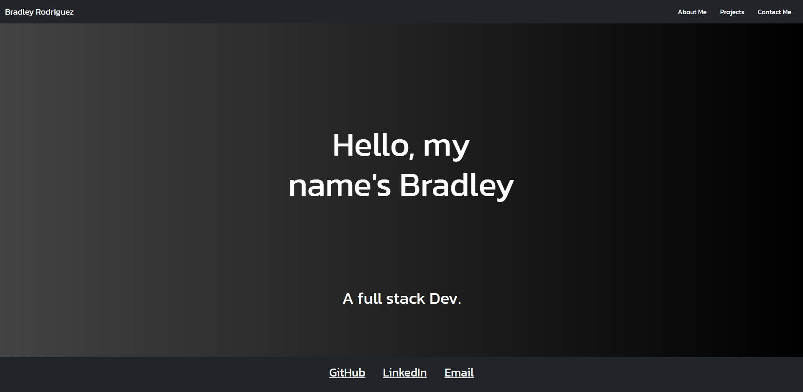

# Portfolio

[](https://opensource.org/licenses/MIT)

## Description

A porfolio for Bradley Rodriguez, contains an about me, contact me, and projects section.

## Table of Contents (Optional)

- [Installation](#installation)
- [Usage](#usage)
- [Questions](#questions)

## Installation

To install necessary depenencies, run the follwing command:

```md
npm i
```

## Usage

Navigate the website throught the navbar, click on my name in the top left for the homepage.


## How to Contribute

Feel free to contribute how you like.

## Tests

n.a

## Questions?

Reach out to me!

-GitHub: [HeyItsBradley](https://github.com/HeyItsBradley)

-Email: bradleyrodriguez77@gmail.com
